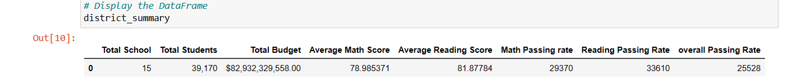
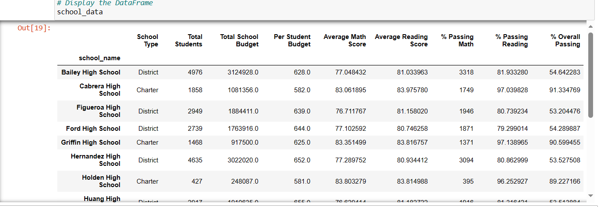
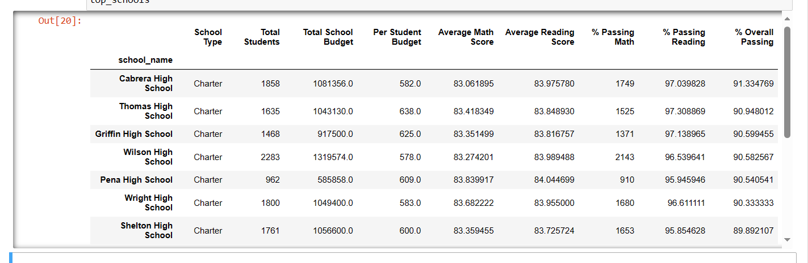
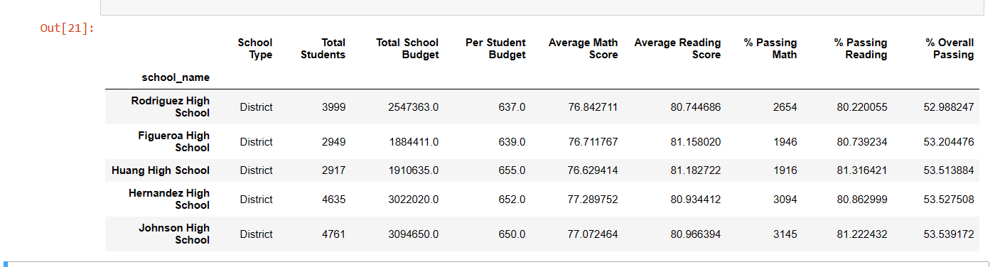
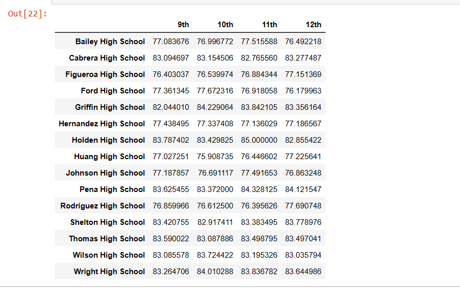
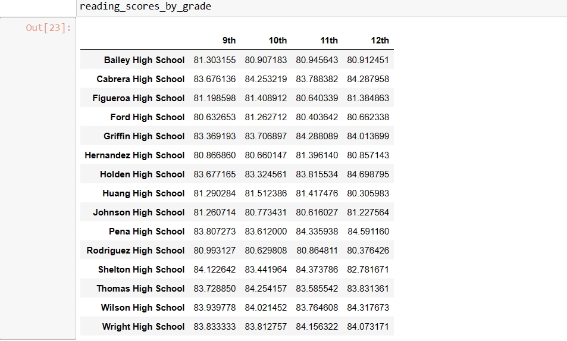
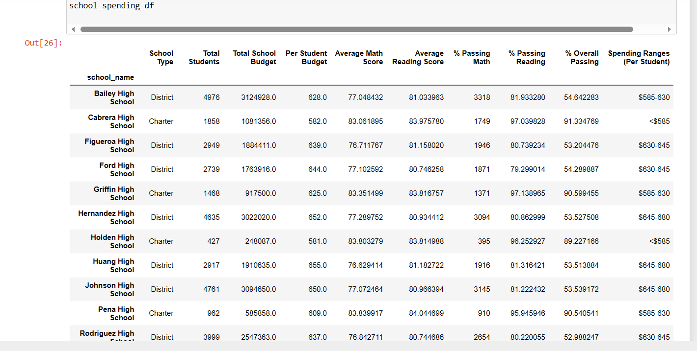
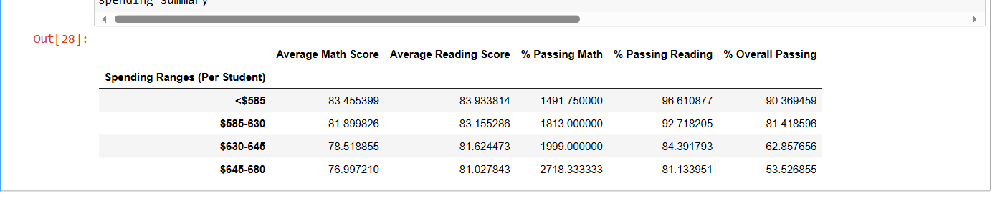
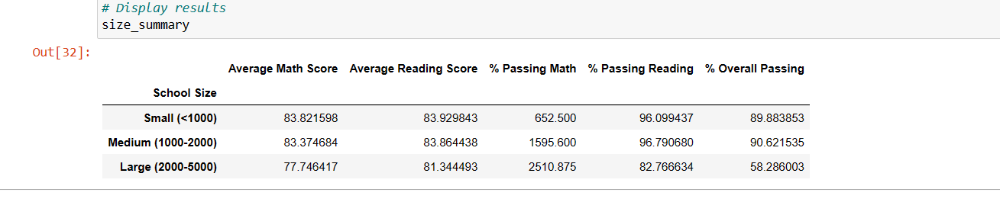
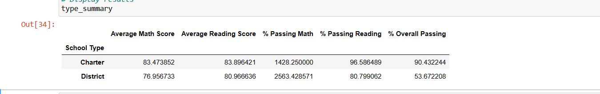

# pandas-challenge

# School_District_Analysis_Challenge
PyCitySchools with Pandas

# Result
 ## District Summary Include the following:
1. Total number of unique schools
2. Total students
3. Total budget
4. Average math score
5. Average reading score
6. % passing math (the percentage of students who passed math)
7. % passing reading (the percentage of students who passed reading)
8. % overall passing (the percentage of students who passed math AND reading)ntage of students who passed math), 

 ## School Summary Include the following:
1. School name
2. School type
3. Total students
4. Total school budget
5. Per student budget
6. Average math score
7. Average reading score
8.% passing math (the percentage of students who passed math)
9. % passing reading (the percentage of students who passed reading)
10. % overall passing (the percentage of students who passed math AND reading)

## Highest-Performing Schools (by % Overall Passing)

## Bottom-Performing Schools (by % Overall Passing)

## Math Scores by Grade

## Reading Scores by Grade

## Scores by School Spending

## Scores by School Size

## Scores by School Type

# Written Resport

## Summary: 

1. The overall passing rate for Thomas High School changed dramatically from 91% to 65%. 

2. Thomas High School's ranking dropped from 2nd to 8th in the district of 15 campuses. 

3. Data at the grade level will now show as "NaN" in reports for the 9th grade students at Thomas High School  

4. In addition to the overall passing rate, the campus math and reading averages and passing percentages all saw shifts.  

The major changes will be seen at the lower views of the disaggregated data with minor impact to the larger data views.

## Conclusion

After removing the ninth-grade math and reading scores from Thomas High School, it affacts summary tables by slightly reducing the average scores and enomous decreasing for the passing percentage rate, including both math and reading passing percentage as well as overall passing percentage.

### Tables

There are 20 Analysis tables are in the picture folder. Attached are two examples. 

1. The *Thomas_9th_info* is information about descriptive statistic before removing the ninth-grade math and reading scores from Thomas High School.

)
-----------------------------------------------------------------------------------------------------------------------------------------------------
2. The *final_compare_summary* is the two summary tables groupby each school, comparing between before and after removing incorrect data.
)
